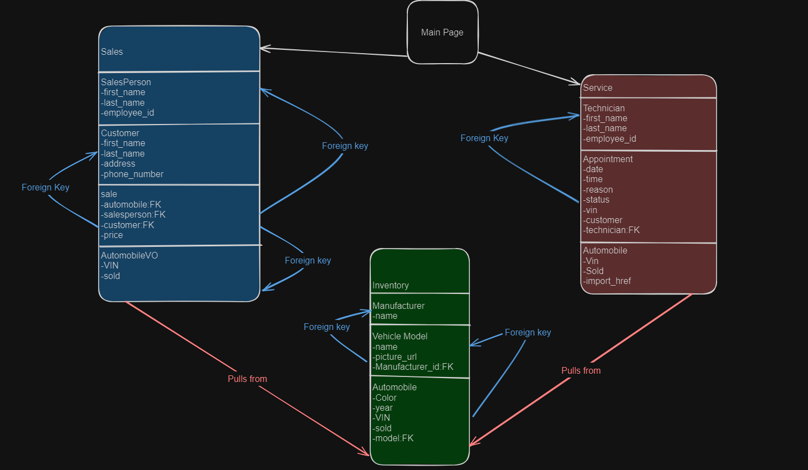

# CarCar
****
## Team

##### Max Vuong - Service
##### Daniel Kim - Sales

## How to setup the project
****
1. fork/clone the repo
2. run the command `docker volume create beta-data`
3. run the command `docker-compose build`
4. run the command `docker-compose up`
5. your front end page will be accessible at http://localhost:5173/

## Design Diagram
****


## Service microservice
****
##### Models
**AutomobileVO**
all automobile data is pulled from the Inventory microservice
- import_href:the import href for the automobile
- vin: the vin for the automobile
- sold: a boolean for if the vehicle has been sold

**Technician**
- first_name: the first name for the technician
- last_name: the last name for the technician
- employee_id: the employee ID for the technician

**Appointment**
- date: the date for the appointment
- time: the time for the appointment
- reason: the reason for the appointment
- status: the status of the appointment, Default is "in progress"
- vin: the vin for the automobile being worked on for the appointment
- customer: the customer for the appointment
- technician: a foreign key to the technician working on this appointment

##### API Methods
**http://localhost:8080/api/technicians/**
- GET: returns a list of all technicians
- POST: adds a technician to the the database

**http://localhost:8080/api/technicians/:id/**
- DELETE: deletes the technician at the specified database ID

**http://localhost:8080/api/appointments/**
- GET: returns a list of all appointments
- POST: adds an appointment to the database

**http://localhost:8080/api/appointments/:id/**
- Get: returns all details for a single appointment
- DELETE: deletes the appointment at the specified database ID

**http://localhost:8080/api/appointments/:id/cancel/**
- PUT: sets the appointment at the specified database ID to cancelled

**http://localhost:8080/api/appointments/:id/finish/**
- PUT: sets the appointment at the specified database ID to finished

## Sales microservice
****

There are three key components utilized in this project:
1. **React (Front-end)** - A powerful Javascript library used to build and render single page applications (SPA). We will be taking advantage of React's component based architecture to render dynamic (on demand) pages such as lists and forms by assembling components and managing states.
2. **API (Back-end)** -- A Django application with a project named `sales_project` and an application (app) named `sales_rest` that uses the REST Framework. This will be built on our models and API views that handle a multitude of the server-side duties.
3. **Poller** -- An application that creates or updates an `AutomobileVO` object to the microservice database and retrieves automobile data from the Inventory API every 60 seconds.

The Sales microservice provides a wide range of functionality by managing and organizing the data of four models on the backend (server-side):

**Automobile** - A value object representing all of our automobiles/vehicles. All automobile data is pulled from the Inventory microservice
- vin -- The vehicle identification number of the automobile
- sold -- A boolean value that represents if the vehicle is available or sold

**Salesperson** - An integral part of the organization responsible for selling the vehicles
- first_name -- The first name of the salesperson employee
- last_name -- The last name of the salesperson employee
- employee_id -- The employee identification of the salesperson employee

**Customer** - Valued individuals who play an important role in driving revenue through purchasing/servicing
- first_name -- The first name of the customer
- last_name -- The last name of the customer
- address -- The residence of the customer
- phone_number -- The ten-digit contact number of the customer

**Sale** - Represents a vehicle sale
- automobile -- Foreign key to the vehicle that was sold
- salesperson -- Foreign key to the salesperson who made the sale
- customer -- Foreign key linked to the customer who purchased the vehicle
- price -- The cost in USD the vehicle was purchased for


## Sales Microservice API
**Port 8090 (Access through an API client of your choice such as Insomnia or Thunderclient)**

### Customers:
| Action | Method | URL
| ----------- | ----------- | ----------- |
| List all customers | GET | http://localhost:8090/api/customers/
| Create a customer | POST | http://localhost:8090/api/customers/
| Details of a specific customer | GET | http://localhost:8090/api/customers/:id/
| Update details of a specific customer | PUT | http://localhost:8090/api/customers/:id/
| Delete a specific customer | DELETE | http://localhost:8090/api/customers/:id/
*All customer ID's are be provided at: http://localhost:8090/api/customers/*

To **create** a Customer (send this to the JSON body):
```
{
	"first_name": "Bailey",
	"last_name": "Dakota",
	"address": "3505 Cherry Lane, Los Angeles, CA 90020",
	"phone_number": "323-123-1234"
}
```
Return value of creating a Customer:
```
{
    "id": 1,
    "first_name": "Bailey",
    "last_name": "Dakota",
    "address": "3505 Cherry Lane, Los Angeles, CA 90020",
    "phone_number": "323-123-1234"
}
```
Return value of **listing all Customers**:
```
{
	"customers": [
		{
			"first_name": "Bailey",
			"last_name": "Dakota",
			"address": "3505 Cherry Lane, Los Angeles, CA 90020",
			"phone_number": "323-123-1234",
			"id": 1
		},
		{
			"first_name": "Devin",
			"last_name": "Gates",
			"address": "623 Cottage Ave, Albany, NY 12203",
			"phone_number": "932-654-8342",
			"id": 2
		}
	]
}
```
To **update** the detail(s) of a specific Customer (make any adjustments within the boundaries of the model field type):
*Note: Replace `:id` with the specified customer ID you would like to update.*
```
{
    "address": "5311 Fairview Avenue, Anaheim, CA 92805"
}
```
Return value of updating the detail(s) of a specific Customer:
```
{
    "id": 1,
    "first_name": "Bailey",
    "last_name": "Dakota",
    "address": "5311 Fairview Avenue, Anaheim, CA 92805",
    "phone_number": "323-123-1234"
}
```

To **delete** a Customer, send a DELETE request to http://localhost:8090/api/customers/:id/
*Note: Replace `:id` with the specified customer ID you would like deleted.*
*All customer ID's can be provided at: http://localhost:8090/api/customers/*

Return value of deleting a specific Customer:
```
{
    "deleted": true
}
```